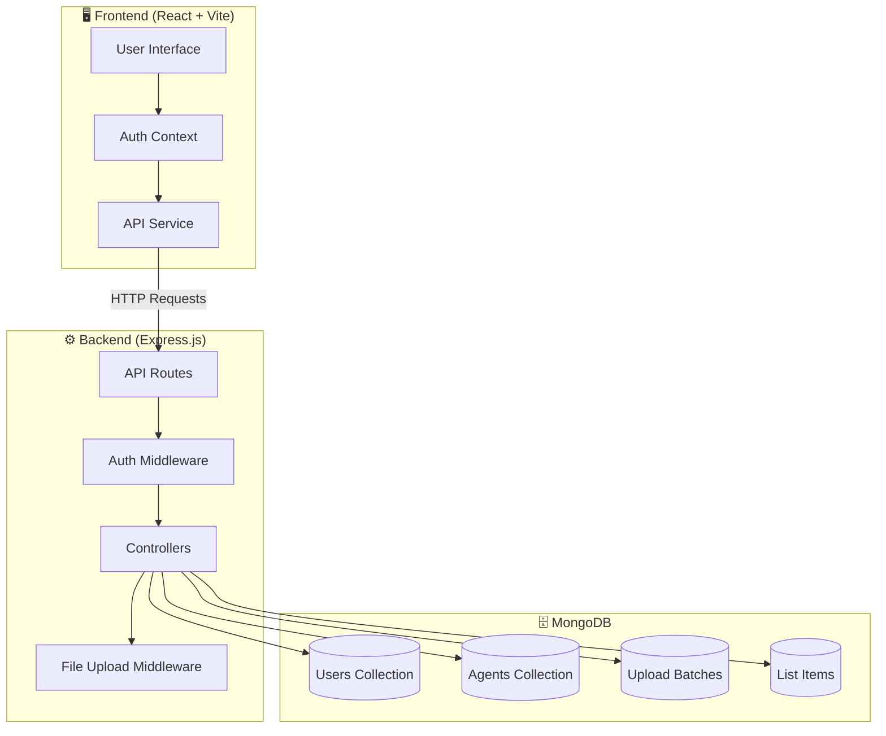
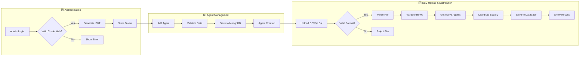
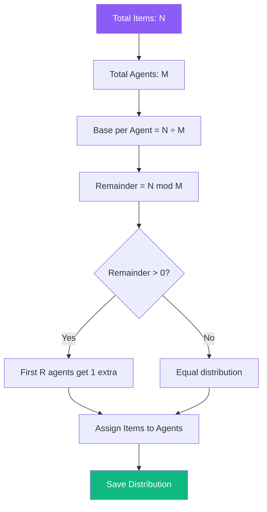
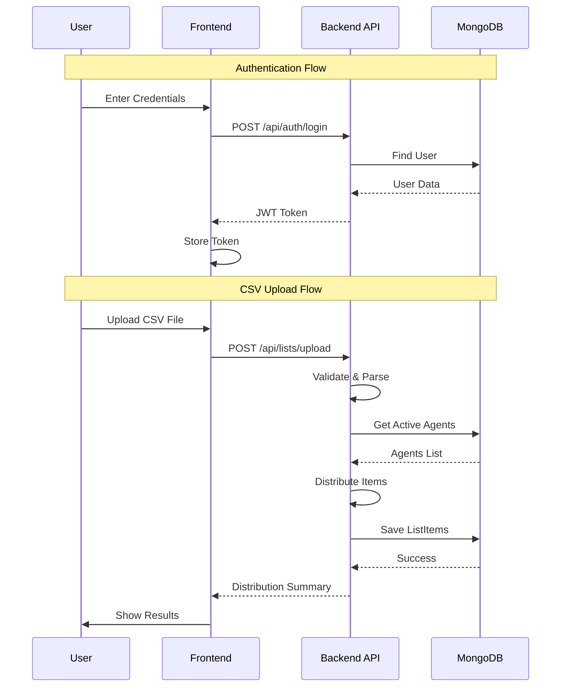

# Agent Task Distribution System - MERN Stack Application

A full-stack MERN application for managing agents and distributing CSV-based tasks among them.

## Features

- 🔐 **Admin Authentication** - Secure JWT-based login system
- 👥 **Agent Management** - Create, view, edit, and delete agents
- 📊 **CSV Upload & Distribution** - Upload CSV/XLSX files and automatically distribute items among agents
- 📱 **Responsive Design** - Modern, user-friendly interface

## Tech Stack

- **Frontend**: React.js with Vite
- **Backend**: Node.js with Express.js
- **Database**: MongoDB
- **Authentication**: JWT (JSON Web Tokens)

## System Architecture



## Application Workflow



## Distribution Algorithm



## Data Flow Diagram



## Prerequisites

- Node.js (v18 or higher)
- MongoDB (local installation or MongoDB Atlas)
- npm or yarn

## Project Structure

```
CSTech/
├── backend/               # Express.js backend
│   ├── config/           # Configuration files
│   ├── controllers/      # Route controllers
│   ├── middleware/       # Custom middleware
│   ├── models/           # MongoDB models
│   ├── routes/           # API routes
│   └── server.js         # Entry point
├── frontend/             # React.js frontend
│   ├── src/
│   │   ├── components/   # React components
│   │   ├── pages/        # Page components
│   │   ├── context/      # React context
│   │   └── services/     # API services
│   └── ...
└── README.md
```

## Setup Instructions

### 1. Clone and Install Dependencies

```bash
# Install backend dependencies
cd backend
npm install

# Install frontend dependencies
cd ../frontend
npm install
```

### 2. Configure Environment Variables

Create a `.env` file in the `backend` directory:

```env
PORT=5000
MONGODB_URI=mongodb://localhost:27017/agent_distribution
JWT_SECRET=your_super_secret_jwt_key_change_this_in_production
JWT_EXPIRE=7d
```

### 3. Seed Admin User

```bash
cd backend
npm run seed
```

This creates a default admin user:
- **Email**: admin@example.com
- **Password**: Admin@123

### 4. Run the Application

**Option 1: Run separately**

```bash
# Terminal 1 - Backend
cd backend
npm run dev

# Terminal 2 - Frontend
cd frontend
npm run dev
```

**Option 2: Run concurrently**

```bash
cd backend
npm run dev:full
```

### 5. Access the Application

- **Frontend**: http://localhost:5173
- **Backend API**: http://localhost:5000

## API Endpoints

### Authentication
| Method | Endpoint | Description |
|--------|----------|-------------|
| POST | `/api/auth/login` | Admin login |
| GET | `/api/auth/me` | Get current user |

### Agents
| Method | Endpoint | Description |
|--------|----------|-------------|
| GET | `/api/agents` | Get all agents |
| POST | `/api/agents` | Create new agent |
| PUT | `/api/agents/:id` | Update agent |
| DELETE | `/api/agents/:id` | Delete agent |

### Lists
| Method | Endpoint | Description |
|--------|----------|-------------|
| POST | `/api/lists/upload` | Upload and distribute CSV |
| GET | `/api/lists` | Get all distributed lists |
| GET | `/api/lists/agent/:agentId` | Get lists by agent |
| DELETE | `/api/lists/:id` | Delete a list |

## CSV Format

The CSV file should contain the following columns:
- **FirstName** - Text (required)
- **Phone** - Number (required)
- **Notes** - Text (optional)

Example:
```csv
FirstName,Phone,Notes
John,1234567890,Sample note
Jane,0987654321,Another note
```

## Distribution Logic

- Items are distributed equally among all available agents
- If items cannot be divided equally, remaining items are distributed sequentially
- Example: 17 items among 5 agents = 4, 4, 3, 3, 3 items each

## Video Demonstration

[Link to Google Drive Video](#) - *Add your video link here*

## License

MIT License
